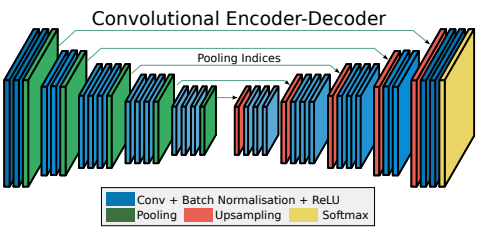
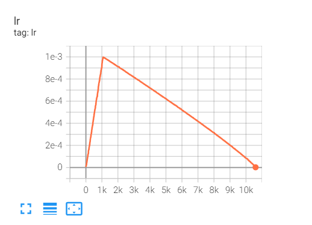
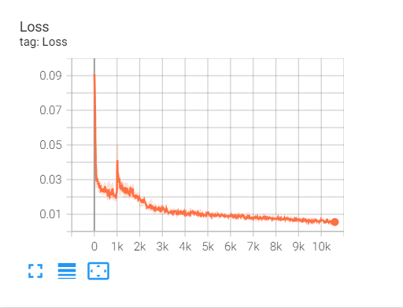
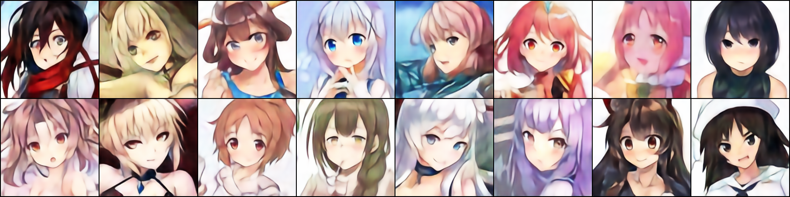
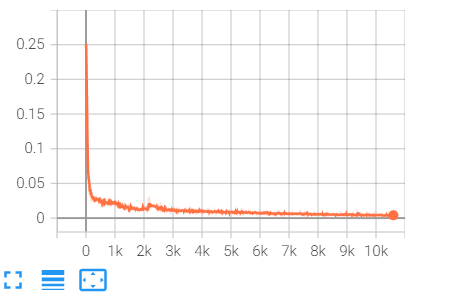

# AutoEncoder

##### 注意：该代码并不是真正的AutoEncoder，但是可以通过简单的更改即可。(代码自己乱写的，实现简单，但是有助于自己理解)

------

*2021.11.19:*

​	**```补充：后来通过了解知道，我这种写法叫做 Convolutional-AutoEncoder。（真让人害羞(✿◡‿◡)）```**

------

### 1. 网络模型	

这个模型结构其实是```SegNet```，而且恰巧也在了解AutoEncoder，所以当看到这个图的时候，突然就有了想自己尝试写一下的冲动。

于是第一次尝试就是看着这个图写的，中间生成的是 ```特征图``` 而不是一个 ```向量```。


Encoder部分采用的VGG16， Decoder部分是与之对称的。(其实结构没必要这么复杂)



```注意：AutoEncoder的两个部分不一定是对称的```

------

### 2. 训练可视化

#### (1) 学习率曲线

```对于学习率的调整，这里采用 WarmUp 的调成测率，它能使模型更容易收敛。```




#### (2)  Loss 损失曲线

```什么也不用说，简直就是完美！！！```




#### (3) 训练过程中的输入和输出

```输入图片：```


------

```输出图片：```




### 3. 文件下载

##### a. 权重：Link: https://pan.baidu.com/s/1pqGgaSRBal8HC3flYVirSA pw: 5c9e 

##### b. 数据集：Link: https://pan.baidu.com/s/1oVo9SE8phibpZWRBskFjaA pw: hc2b 


------

**-----------------------------------------------------------------这是分割线---------------------------------------------------------------**

------

### 4. 采用 VGG13 结构模型

#### (1)  Loss 损失曲线

```也是非常完美的!!!!!!```




### (2) Encoder激活函数

#### （a).  不采用激活函数

```python
if nums == 1:
    return nn.Sequential(nn.Conv2d(in_channels=in_channels,
                                   out_channels=out_channels,
                                   kernel_size=3,
                                   padding=1), )
```


训练100个epoch 结果 如下图：(上图为训练时的输入数据)


**！！！！！！！** **通过对比可知，图像整体还可以，但是仿佛蒙上了一层纱，图像亮度较暗，但是细节却都没有损失。**  **！！！！！！！**


#### (b). 采用 Sigmoid 激活函数

```python
if nums == 1:
    return nn.Sequential(nn.Conv2d(in_channels=in_channels,
                                   out_channels=out_channels,
                                   kernel_size=3,
                                   padding=1),
                         nn.Sigmoid())
```


训练100个epoch 结果 如下图：(上图为训练时的输入数据)


**！！！！！！** **通过对比可知，图像的亮度大幅度增加，但是细节却被柔化了。**  **！！！！！！**


#### (c). 原因分析

在书写代码时，我对数据进行了归一化处理，是每个像素值处于 0-1 之间。同时采用的损失函数为 **均方误差(MSE)**，但是生成的结果却不相同的格式（像素值 0-1 之间）。

-------

***不同数据处理方式对应的激活函数应认真选择，以及实现某功能所需要的损失函数也不同！！！！！***

-------

**注意： 这个分析不一定争正确**

```python
Transform = transforms.Compose([transforms.Resize((224, 224)),
                                transforms.ToTensor()])  # transforms.ToTensor() 归一化处理

train_data = AnimeData(dataRoot=args.dataSet, subFold="train", transform=Transform)
```


####  (d) 权重下载

**a. 权重_无损失函数：Link: https://pan.baidu.com/s/1EExW9EtKx55JGym0zOgemw   pw: 8xit**

**b. 权重_Sigmoid：Link: https://pan.baidu.com/s/1nL6rM7ID8OrDCjfFXo7T3w   pw: fi18**


# 未完待续（其它尝试）。。。。。。

## 1. 单独把Decoder拿出来， 喂给它随机特征图，看会的到什么

## 2. VAE

## 3. 不可说

## 4. 。。。。。。

